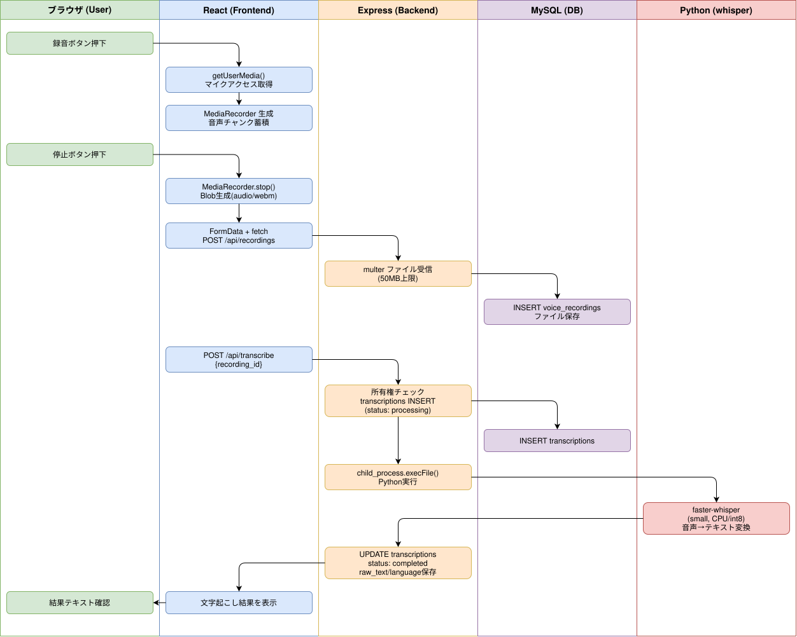

# ActiveRecall Phase 1: 音声録音・文字起こし基盤

## 概要

ブラウザの MediaRecorder API で音声を録音し、multer でサーバーにアップロード後、Python(faster-whisper) で文字起こしを行うフロー。

## ワークフロー図

## 処理フロー解説

### 音声録音フロー

1. **ブラウザ**: VoiceTest 画面で録音ボタンをクリック
2. **React (VoiceRecorder.js)**: `navigator.mediaDevices.getUserMedia({audio: true})` でマイクアクセス取得
3. **React**: MediaRecorder インスタンスを生成、`ondataavailable` で音声チャンクを蓄積
4. **ブラウザ**: ユーザーが録音停止ボタンをクリック
5. **React**: MediaRecorder.stop() → Blob を生成（audio/webm）

### 音声アップロードフロー

1. **React**: FormData に Blob を追加、`POST /api/recordings` を fetch（credentials: include）
2. **Express (recordings.js)**: multer ミドルウェアでファイル受信（50MB上限、5種MIMEタイプ）
3. **Express**: ファイルを `uploads/{user_id}/` に保存、voice_recordings テーブルに INSERT
4. **MySQL**: `INSERT INTO voice_recordings (user_id, file_path, file_size, mime_type) VALUES (...)`
5. **React**: アップロード成功 → recording_id を取得

### 文字起こしフロー

1. **React**: `POST /api/transcribe` に `{recording_id}` を送信
2. **Express (transcribe.js)**: recording_id の所有権チェック → transcriptions に 'processing' で INSERT
3. **Express**: `child_process.execFile()` で Python スクリプトを実行（タイムアウト: 5分）
4. **Python (transcribe.py)**: faster-whisper (small, CPU/int8) でモデルロード → 音声ファイルを文字起こし
5. **Python**: `{text, language, duration}` をJSON形式で stdout に出力
6. **Express**: stdout をパース → transcriptions を 'completed' に UPDATE、raw_text/language 保存
7. **React**: レスポンスの transcription オブジェクトを表示
8. **ブラウザ**: 文字起こし結果テキストを確認

### エラーハンドリング

- **Python 実行失敗**: transcriptions を 'failed' に UPDATE、error_message を保存
- **クライアント切断**: `res.headersSent` ガードで二重レスポンス防止
- **DB更新エラー**: catch ブロックで 500 エラーを返却

## 関連ソースファイル

| ファイルパス | 役割 |
|---|---|
| `backend/routes/recordings.js` | 音声ファイルアップロード・一覧・削除API（multer） |
| `backend/routes/transcribe.js` | 文字起こし実行・結果取得API（child_process） |
| `backend/scripts/transcribe.py` | faster-whisper による文字起こしスクリプト |
| `frontend/src/components/VoiceRecorder.js` | 再利用可能な音声録音コンポーネント（MediaRecorder API） |
| `frontend/src/components/VoiceTest.js` | 動作確認画面（/voice-test） |
| `docker/mysql/init/011_create_voice_tables.sql` | voice_recordings + transcriptions テーブル定義 |
| `backend/Dockerfile` | node:18-slim + Python3 + faster-whisper |

## DBテーブル

### voice_recordings

| カラム | 型 | 説明 |
|---|---|---|
| id | INT AUTO_INCREMENT | 主キー |
| user_id | INT NOT NULL | ユーザーID（FK: users.id, CASCADE） |
| file_path | VARCHAR(500) | ファイル保存パス |
| file_size | INT | ファイルサイズ（バイト） |
| duration_seconds | DECIMAL(8,2) | 録音時間（秒、文字起こし後に更新） |
| mime_type | VARCHAR(50) | MIMEタイプ（audio/webm 等） |
| created_at | TIMESTAMP | 作成日時 |

### transcriptions

| カラム | 型 | 説明 |
|---|---|---|
| id | INT AUTO_INCREMENT | 主キー |
| recording_id | INT NOT NULL | 録音ID（FK: voice_recordings.id, CASCADE） |
| user_id | INT NOT NULL | ユーザーID |
| raw_text | TEXT | 文字起こし結果テキスト |
| language | VARCHAR(10) | 検出言語（ja, en 等） |
| status | ENUM('pending','processing','completed','failed') | 処理状態 |
| error_message | TEXT | エラーメッセージ（失敗時） |

## APIエンドポイント

| Method | Path | 概要 |
|---|---|---|
| POST | /api/recordings | 音声ファイルアップロード（multer, 50MB上限） |
| GET | /api/recordings | 自分の録音一覧取得 |
| DELETE | /api/recordings/:id | 録音削除（ファイル物理削除含む） |
| POST | /api/transcribe | 文字起こし実行（child_process + Python） |
| GET | /api/transcriptions/:id | 文字起こし結果取得 |
