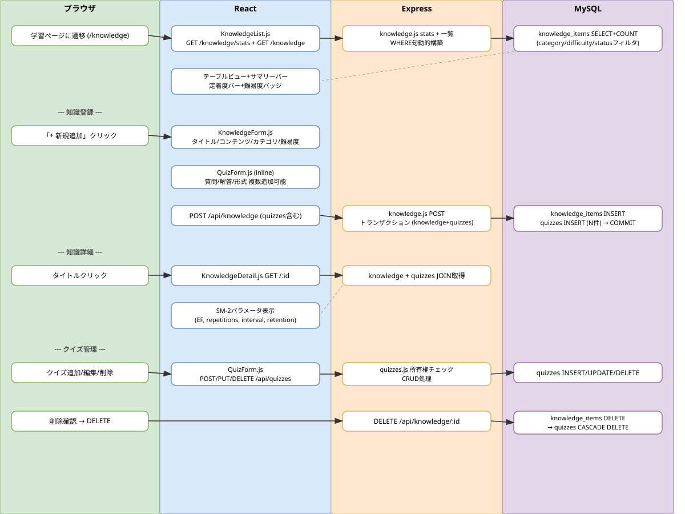

# ActiveRecall Phase 2: 知識管理 + クイズ管理

## 概要

知識アイテムのCRUD、クイズのCRUD、SM-2パラメータ基盤を実装。知識とクイズの同時作成（トランザクション）、統計サマリーバー、フィルタリング、定着度プログレスバーを提供する。

## ワークフロー図

## 処理フロー解説

### 知識登録フロー（クイズ同時作成）

1. **ブラウザ**: ユーザーがサイドバーから「学習」ページに遷移（/knowledge）
2. **React（KnowledgeList.js）**: 「+ 新規追加」ボタンクリックで /knowledge/new に遷移
3. **React（KnowledgeForm.js）**: タイトル、コンテンツ、カテゴリ、難易度を入力。「+ クイズを追加」で QuizForm をインライン表示し、複数クイズを追加可能
4. **React（QuizForm.js）**: 質問、解答、形式（free_text/multiple_choice）を入力。選択式の場合は4選択肢+正解ラジオボタン
5. **React**: 「登録」ボタンで POST /api/knowledge（body に quizzes 配列を含む）
6. **Express（knowledge.js）**: トランザクション開始。knowledge_items に INSERT。quizzes 配列がある場合は各クイズを quizzes テーブルに INSERT
7. **MySQL**: knowledge_items + quizzes を原子的に作成。SM-2パラメータ初期値: EF=2.50, repetitions=0, interval_days=0
8. **React**: 保存成功後、/knowledge/:id（詳細画面）に遷移

### 知識一覧・フィルタリングフロー

9. **React（KnowledgeList.js）**: GET /api/knowledge/stats で統計取得（全体/今日復習/習得済み/学習中/未開始）
10. **React**: GET /api/knowledge?category=X&difficulty=Y&status=due で一覧取得
11. **Express（knowledge.js）**: クエリパラメータに基づく WHERE 句動的構築。status=due: next_review_date <= TODAY、status=mastered: retention_score >= 80 AND interval_days >= 30、status=not_started: repetitions = 0
12. **React**: テーブルビュー表示。定着度プログレスバー、難易度カラーバッジ、次回復習日（期限切れ赤色）

### 知識詳細・クイズ管理フロー

13. **React（KnowledgeDetail.js）**: GET /api/knowledge/:id で詳細+クイズ一覧取得
14. **React**: SM-2パラメータ表示（EF、復習回数、間隔、次回復習日、定着度）
15. **React**: クイズ管理セクション — 追加（POST /api/knowledge/:id/quizzes）、編集（PUT /api/quizzes/:id）、削除（DELETE /api/quizzes/:id、確認ダイアログ）
16. **Express（quizzes.js）**: 各操作で所有権チェック（user_id 一致確認）

### 知識削除フロー

17. **React**: 削除確認ダイアログ表示後、DELETE /api/knowledge/:id
18. **Express**: knowledge_items DELETE → CASCADE で quizzes も自動削除
19. **React**: 削除後 /knowledge に遷移

## 関連ソースファイル

| ファイルパス | 役割 |
|---|---|
| backend/routes/knowledge.js | 知識CRUD + stats + フィルタ（トランザクション対応） |
| backend/routes/quizzes.js | クイズCRUD + 所有権チェック |
| backend/server.js | ルート登録（/api/knowledge, /api） |
| frontend/src/components/KnowledgeList.js | 知識一覧（統計サマリーバー + フィルタ + テーブル） |
| frontend/src/components/KnowledgeForm.js | 知識 新規/編集フォーム（クイズ同時作成） |
| frontend/src/components/KnowledgeDetail.js | 知識詳細 + SM-2パラメータ + クイズ管理 |
| frontend/src/components/QuizForm.js | 再利用可能クイズフォーム（free_text/multiple_choice） |
| frontend/src/App.js | ルート定義（/knowledge, /knowledge/new, /knowledge/:id, /knowledge/:id/edit） |
| frontend/src/components/Sidebar.js | ナビゲーション（📚 学習） |
| docker/mysql/init/012_create_knowledge_tables.sql | テーブル定義（4テーブル） |

## DBテーブル

### knowledge_items

| カラム | 型 | 説明 |
|---|---|---|
| id | INT AUTO_INCREMENT | 主キー |
| user_id | INT NOT NULL | ユーザーID |
| title | VARCHAR(255) | タイトル |
| content | TEXT | コンテンツ |
| category | VARCHAR(100) | カテゴリ（任意） |
| difficulty | ENUM('easy','medium','hard') | 難易度（デフォルト medium） |
| easiness_factor | DECIMAL(4,2) | SM-2 EF（デフォルト 2.50） |
| repetitions | INT | 復習回数（デフォルト 0） |
| interval_days | INT | 復習間隔（日、デフォルト 0） |
| next_review_date | DATE | 次回復習日 |
| retention_score | DECIMAL(5,2) | 定着度（0-100%） |

### quizzes

| カラム | 型 | 説明 |
|---|---|---|
| id | INT AUTO_INCREMENT | 主キー |
| knowledge_item_id | INT NOT NULL | 紐づく知識ID（CASCADE DELETE） |
| user_id | INT NOT NULL | ユーザーID |
| question | TEXT | 質問 |
| answer | TEXT | 解答 |
| quiz_type | ENUM('free_text','multiple_choice') | 形式 |
| options_json | JSON | 選択肢（multiple_choice時） |

### review_sessions（Phase 3 用、テーブル作成のみ）

### quiz_attempts（Phase 3 用、テーブル作成のみ）

## APIエンドポイント

| Method | Path | 概要 |
|---|---|---|
| GET | /api/knowledge/stats | 統計情報（全体/今日復習/習得済み/学習中/未開始） |
| GET | /api/knowledge | 知識一覧（category/difficulty/statusフィルタ） |
| GET | /api/knowledge/:id | 知識詳細（クイズ一覧含む） |
| POST | /api/knowledge | 知識作成（クイズ同時作成、トランザクション） |
| PUT | /api/knowledge/:id | 知識更新 |
| DELETE | /api/knowledge/:id | 知識削除（CASCADE） |
| GET | /api/knowledge/:knowledgeId/quizzes | クイズ一覧取得 |
| POST | /api/knowledge/:knowledgeId/quizzes | クイズ追加 |
| PUT | /api/quizzes/:id | クイズ更新（所有権チェック） |
| DELETE | /api/quizzes/:id | クイズ削除（所有権チェック） |
