# バグ修正（ログ強化）+ Toast通知システム ワークフロー

wishes 保存失敗の原因調査に伴うバックエンドログ強化（日本語化+プレフィックス付きログ）と、フロントエンドのトースト通知システム（ToastProvider + useToast フック）の実装ワークフロー。

## ワークフロー図

## 処理フロー解説

### バックエンド: ログ強化 + エラーメッセージ日本語化

1. **ブラウザ**: ユーザーが認証が必要な操作を実行（例: やりたいこと一覧取得）
2. **Express (middleware/auth.js)**: `requireAuth` ミドルウェアでセッションチェック。未認証時のエラーメッセージを日本語化（「ログインが必要です。再度ログインしてください。」）
3. **Express (routes/wishes.js)**: リクエストログを `[wishes]` プレフィックス付きで出力（例: `[wishes] GET /api/wishes user_id=1`）
4. **Express (routes/auth.js)**: ログイン成功/失敗ログを `[auth]` プレフィックス付きで出力

### フロントエンド: Toast通知システム

1. **React (App.js)**: アプリ全体を `<ToastProvider>` でラップ。Toast の Context を全コンポーネントに提供
2. **React (Toast.js)**: `ToastProvider` が `toasts` state（配列）を管理。`useToast` フックで `showToast(message, type)` 関数を提供
3. **ブラウザ**: ユーザーがやりたいことを操作（追加/編集/削除/ステータス変更等）
4. **React (WishList.js)**: API呼び出し後の結果に応じて `showToast()` を呼び出し
   - 成功時: `showToast('保存しました', 'success')` — 緑色、4秒で自動消去
   - エラー時: `showToast('エラーが発生しました', 'error')` — 赤色、8秒で自動消去
5. **React (Toast.js)**: 新しいトーストを `toasts` 配列に追加。一意IDを生成
6. **ブラウザ**: 画面右上にトースト通知がスライドインアニメーションで表示。複数同時スタック可能
7. **React (Toast.js)**: `setTimeout` で設定時間後に該当トーストを `toasts` 配列から削除。フェードアウトアニメーション
8. **ブラウザ**: ユーザーが×ボタンをクリックで手動消去も可能

### 旧 showMessage からの移行

1. **移行前**: `WishList.js` 内の `showMessage` state + `setTimeout` による独自メッセージ表示
2. **移行後**: `useToast()` フックに完全置換。トースト通知はアプリ全体で共通利用可能

## 関連ソースファイル

| ファイルパス | 役割 |
|------------|------|
| `backend/middleware/auth.js` | requireAuth エラーメッセージ日本語化 |
| `backend/routes/auth.js` | ログイン成功/失敗ログの `[auth]` プレフィックス付き出力 |
| `backend/routes/wishes.js` | リクエストログの `[wishes]` プレフィックス付き出力 |
| `frontend/src/components/Toast.js` | ToastProvider（Context）+ useToast フック + Toast表示コンポーネント |
| `frontend/src/components/Toast.css` | 右上固定、スライドイン/フェードアウトアニメーション、複数スタック |
| `frontend/src/components/WishList.js` | 旧 showMessage → useToast 完全置換 |
| `frontend/src/App.js` | ToastProvider ラッピング追加 |

## APIエンドポイント（既存・変更なし）

| Method | Path | 概要 |
|--------|------|------|
| GET | `/api/auth/me` | セッション確認（エラーメッセージ日本語化） |
| POST | `/api/auth/login` | ログイン（ログ出力強化） |
| GET/POST/PUT/DELETE | `/api/wishes/*` | やりたいこと操作（ログ出力強化） |

## Toast 通知の仕様

| プロパティ | 値 |
|-----------|-----|
| タイプ | success（緑）/ error（赤）/ info（青） |
| 自動消去 | success: 4秒、error: 8秒 |
| 位置 | 画面右上固定（position: fixed） |
| アニメーション | スライドイン（右から）/ フェードアウト |
| スタック | 複数同時表示可能（上から順に積み上げ） |
| 手動消去 | ×ボタンクリック |
| z-index | 2000（最前面） |
