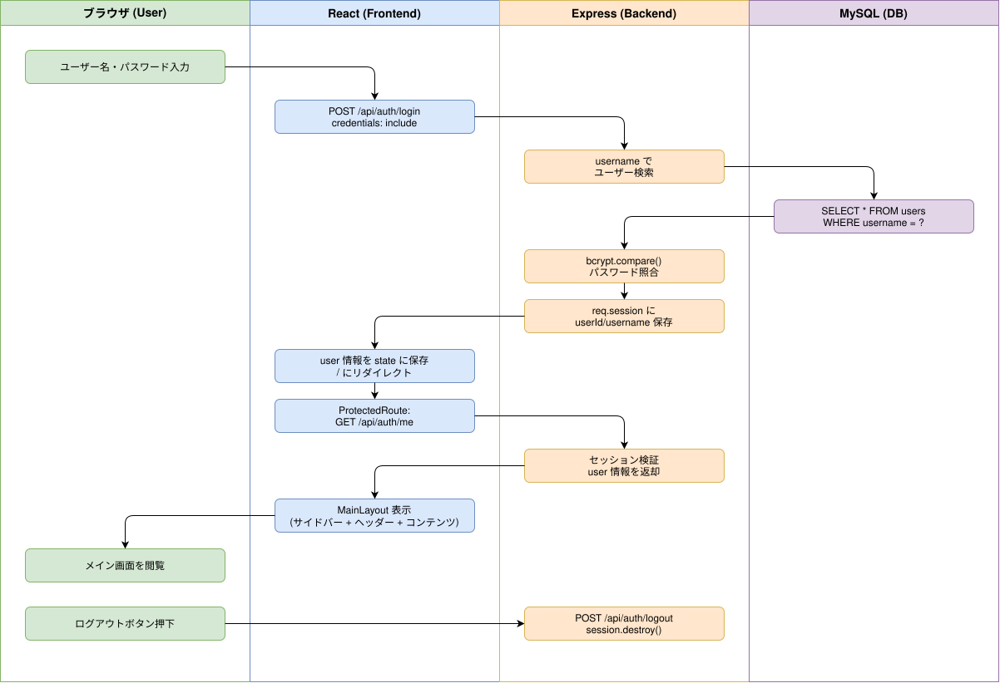

# Sprint 1: ログイン認証フロー

## 概要

ユーザーがログイン画面で認証情報を入力し、セッションベースの認証を経てメインレイアウトにアクセスするまでのフロー。

## ワークフロー図

## 処理フロー解説

### ログインフロー

1. **ブラウザ**: ユーザーがログインフォームにユーザー名・パスワードを入力し送信
2. **React (Login.js)**: `POST /api/auth/login` に `credentials: 'include'` 付きで fetch
3. **Express (auth.js)**: ユーザー名でDB検索、bcryptでパスワード照合
4. **MySQL**: `SELECT id, username, password_hash, display_name FROM users WHERE username = ?`
5. **Express**: 認証成功時、`req.session` にuserId/username/displayNameを保存
6. **React**: レスポンスの user 情報を state に保存、`/` にリダイレクト
7. **React (ProtectedRoute.js)**: `GET /api/auth/me` でセッション有効性を確認
8. **React (MainLayout.js)**: 認証済みの場合、サイドバー + ヘッダー + コンテンツ表示

### ログアウトフロー

1. **ブラウザ**: ヘッダーのログアウトボタンをクリック
2. **React (Header.js)**: `POST /api/auth/logout` を fetch
3. **Express (auth.js)**: `req.session.destroy()` + `res.clearCookie('connect.sid')`
4. **React**: `/login` にリダイレクト

## 関連ソースファイル

| ファイルパス | 役割 |
|---|---|
| `backend/routes/auth.js` | 認証API（POST /login, POST /logout, GET /me） |
| `backend/middleware/auth.js` | requireAuth ミドルウェア（セッション検証） |
| `frontend/src/components/Login.js` | ログインフォームUI |
| `frontend/src/components/ProtectedRoute.js` | 認証済みルートガード（GET /me で検証） |
| `frontend/src/components/MainLayout.js` | メインレイアウト（サイドバー + ヘッダー + コンテンツ） |
| `frontend/src/components/Header.js` | ヘッダー（ログアウトボタン含む） |
| `docker/mysql/init/001_create_tables.sql` | users テーブル定義 |
| `docker/mysql/init/002_seed_data.sql` | シードユーザーデータ（admin, phalanchang） |

## DBテーブル

### users

| カラム | 型 | 説明 |
|---|---|---|
| id | INT AUTO_INCREMENT | 主キー |
| username | VARCHAR(50) UNIQUE | ログインユーザー名 |
| password_hash | VARCHAR(255) | bcryptハッシュ化パスワード |
| display_name | VARCHAR(100) | 表示名 |
| created_at | TIMESTAMP | 作成日時 |
| updated_at | TIMESTAMP | 更新日時 |

## APIエンドポイント

| Method | Path | 概要 |
|---|---|---|
| POST | /api/auth/login | ログイン認証（セッション生成） |
| POST | /api/auth/logout | ログアウト（セッション破棄） |
| GET | /api/auth/me | 現在のユーザー情報取得（セッション検証） |
