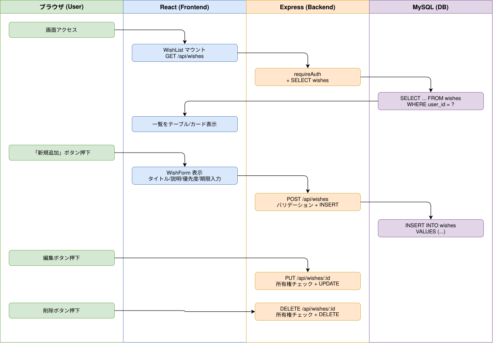

# Sprint 2: 「やりたいこと」CRUD管理

## 概要

「やりたいこと」(wishes)の一覧表示・新規作成・編集・削除の基本CRUDパターン。セッション認証でユーザー所有権を保証する。

## ワークフロー図

## 処理フロー解説

### 一覧表示フロー

1. **React (WishList.js)**: マウント時に `GET /api/wishes` を fetch（credentials: include）
2. **Express (wishes.js)**: requireAuth でセッション検証 → `user_id` で wishes を SELECT
3. **MySQL**: `SELECT ... FROM wishes WHERE user_id = ? ORDER BY created_at DESC`
4. **React**: レスポンスの wishes 配列を state に保存、テーブル/カード表示

### 新規作成フロー

1. **ブラウザ**: 「新規追加」ボタンをクリック
2. **React (WishForm.js)**: タイトル・説明・ステータス・優先度・期限を入力
3. **React**: `POST /api/wishes` に body を送信
4. **Express**: タイトル必須・ENUM値バリデーション → INSERT
5. **MySQL**: `INSERT INTO wishes (user_id, title, description, status, priority, due_date) VALUES (...)`
6. **React**: 作成成功 → 一覧を再取得・更新

### 編集フロー

1. **ブラウザ**: 対象行の編集ボタンをクリック
2. **React (WishForm.js)**: 既存データをフォームにプリフィル
3. **React**: `PUT /api/wishes/:id` に更新データを送信
4. **Express**: 所有権チェック付き UPDATE（`WHERE id = ? AND user_id = ?`）
5. **React**: 更新成功 → 一覧を再取得

### 削除フロー

1. **ブラウザ**: 対象行の削除ボタンをクリック → 確認ダイアログ
2. **React**: `DELETE /api/wishes/:id` を送信
3. **Express**: 所有権チェック付き DELETE
4. **React**: 削除成功 → 一覧から除外

## 関連ソースファイル

| ファイルパス | 役割 |
|---|---|
| `backend/routes/wishes.js` | wishes CRUD API（GET/POST/PUT/DELETE） |
| `backend/middleware/auth.js` | requireAuth ミドルウェア |
| `frontend/src/components/WishList.js` | やりたいこと一覧（テーブル/カードビュー） |
| `frontend/src/components/WishForm.js` | 新規作成・編集フォーム |
| `docker/mysql/init/003_create_wishes_table.sql` | wishes テーブル定義 |

## DBテーブル

### wishes

| カラム | 型 | 説明 |
|---|---|---|
| id | INT AUTO_INCREMENT | 主キー |
| user_id | INT NOT NULL | ユーザーID（FK: users.id, CASCADE） |
| title | VARCHAR(255) | タイトル（必須） |
| description | TEXT | 説明 |
| status | ENUM('not_started','in_progress','completed') | ステータス（デフォルト: not_started） |
| priority | ENUM('high','medium','low') | 優先度（デフォルト: medium） |
| due_date | DATE | 期限 |
| created_at | TIMESTAMP | 作成日時 |
| updated_at | TIMESTAMP | 更新日時 |

## APIエンドポイント

| Method | Path | 概要 |
|---|---|---|
| GET | /api/wishes | 一覧取得（自分のwishesのみ、タグ・画像情報付き） |
| POST | /api/wishes | 新規作成（タイトル必須、ENUM値バリデーション） |
| PUT | /api/wishes/:id | 更新（所有権チェック付き） |
| DELETE | /api/wishes/:id | 削除（所有権チェック付き、画像ファイル自動クリーンアップ） |
