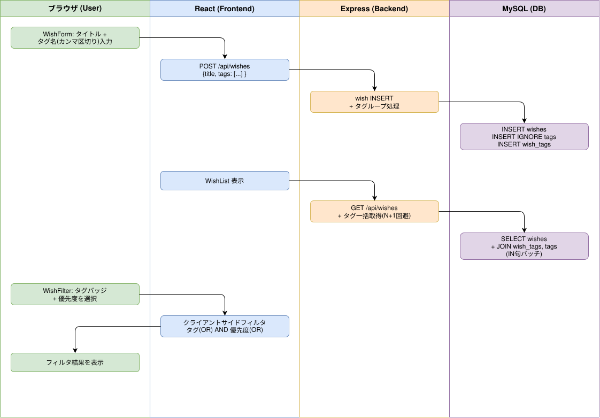

# Sprint 3: タグ機能 + フィルタリング

## 概要

「やりたいこと」にタグ（多対多）を付与し、タグ・優先度によるOR/AND条件フィルタリングを行うフロー。タグは自動作成（INSERT IGNORE）で重複を防ぐ。

## ワークフロー図

## 処理フロー解説

### タグ付き wish 作成フロー

1. **ブラウザ**: WishForm でタイトル等に加えてタグ名をカンマ区切りで入力
2. **React (WishForm.js)**: タグ配列を body に含めて `POST /api/wishes` を送信
3. **Express (wishes.js)**: wish INSERT 後、タグごとに以下を実行:
   - `INSERT IGNORE INTO tags (user_id, name)` でタグ自動作成（既存なら無視）
   - `SELECT id FROM tags WHERE user_id = ? AND name = ?` でタグID取得
   - `INSERT IGNORE INTO wish_tags (wish_id, tag_id)` で中間テーブルに関連付け
4. **MySQL**: wishes + tags + wish_tags の3テーブルに書き込み

### 一覧取得（タグ情報付き）

1. **React (WishList.js)**: `GET /api/wishes` を fetch
2. **Express**: wishes 取得後、wish_ids を IN 句でまとめて `wish_tags JOIN tags` を取得（N+1回避）
3. **React**: 各 wish にタグ配列を付与して表示

### フィルタリングフロー

1. **ブラウザ**: WishFilter UI でタグバッジ・優先度をクリック
2. **React (WishFilter.js)**: 選択タグ（OR条件）・選択優先度（OR条件）を state に保存
3. **React (WishList.js)**: クライアントサイドで AND フィルタ適用:
   - タグフィルタ: 選択タグのいずれかを持つ wish を通過（OR）
   - 優先度フィルタ: 選択優先度のいずれかに一致する wish を通過（OR）
   - 両方選択時: タグ AND 優先度（AND結合）

## 関連ソースファイル

| ファイルパス | 役割 |
|---|---|
| `backend/routes/wishes.js` | wish CRUD（タグ同時作成・全置換対応） |
| `backend/routes/tags.js` | タグ一覧API（GET /api/tags） |
| `frontend/src/components/WishForm.js` | タグ入力UI |
| `frontend/src/components/WishFilter.js` | フィルタリングUI（タグバッジ + 優先度） |
| `frontend/src/components/WishList.js` | フィルタ適用ロジック |
| `docker/mysql/init/005_create_tags_tables.sql` | tags + wish_tags テーブル定義 |

## DBテーブル

### tags

| カラム | 型 | 説明 |
|---|---|---|
| id | INT AUTO_INCREMENT | 主キー |
| user_id | INT NOT NULL | ユーザーID（FK: users.id） |
| name | VARCHAR(50) | タグ名 |
| created_at | TIMESTAMP | 作成日時 |

UNIQUE KEY: (user_id, name) で同一ユーザーの重複タグを防止

### wish_tags（中間テーブル）

| カラム | 型 | 説明 |
|---|---|---|
| wish_id | INT | wish ID（FK: wishes.id, CASCADE） |
| tag_id | INT | タグ ID（FK: tags.id, CASCADE） |

PRIMARY KEY: (wish_id, tag_id) で複合主キー

## APIエンドポイント

| Method | Path | 概要 |
|---|---|---|
| GET | /api/tags | 自分のタグ一覧取得 |
| POST | /api/wishes | 新規作成（tags 配列で同時タグ作成） |
| PUT | /api/wishes/:id | 更新（tags 配列で全置換） |
