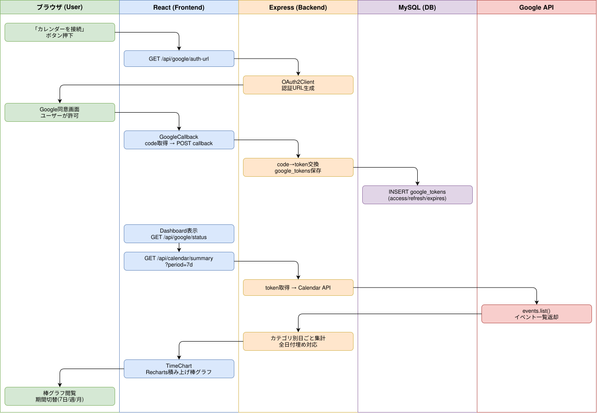

# Sprint 4: Google カレンダー連携 + ダッシュボード棒グラフ

## 概要

Google OAuth 認証でカレンダーに接続し、イベントデータを取得してRecharts積み上げ棒グラフで時間利用を可視化するフロー。

## ワークフロー図

## 処理フロー解説

### OAuth 認証フロー（Sprint 4a）

1. **ブラウザ**: Dashboard で「Googleカレンダーを接続」ボタンをクリック
2. **React (GoogleConnect.js)**: `GET /api/google/auth-url` で認証URLを取得
3. **Express (google.js)**: OAuth2Client で authorization URL を生成（scope: calendar.readonly）
4. **ブラウザ**: Google同意画面にリダイレクト → ユーザーが許可
5. **React (GoogleCallback.js)**: コールバックURLの code パラメータを取得
6. **React**: `POST /api/google/callback` に code を送信
7. **Express**: code → token 交換 → google_tokens テーブルに保存
8. **MySQL**: `INSERT/UPDATE google_tokens (access_token, refresh_token, expires_at, ...)`

### カレンダーデータ取得 + 棒グラフ表示（Sprint 4b）

1. **React (Dashboard.js)**: マウント時に `GET /api/google/status` で接続状態確認
2. **React**: 接続済みの場合、`GET /api/calendar/summary?period=7d` を fetch
3. **Express (calendar.js)**: google_tokens からトークン取得 → Calendar API で events 取得
4. **Google Calendar API**: `events.list()` で指定期間のイベント一覧を返却
5. **Express**: イベントをカテゴリ（colorId）別に日ごとに集計、全日付埋め対応
6. **React (TimeChart.js)**: Recharts StackedBarChart で積み上げ棒グラフ描画
7. **ブラウザ**: 期間切替UI（7日/週/月）で表示期間を変更可能

## 関連ソースファイル

| ファイルパス | 役割 |
|---|---|
| `backend/routes/google.js` | Google OAuth認証（auth-url, callback, status, disconnect） |
| `backend/routes/calendar.js` | カレンダーイベント取得 + summary集計 |
| `frontend/src/components/GoogleConnect.js` | Google接続ボタンUI |
| `frontend/src/components/GoogleCallback.js` | OAuthコールバック処理 |
| `frontend/src/components/Dashboard.js` | ダッシュボード（3状態分岐: 未設定/未接続/接続済み） |
| `frontend/src/components/TimeChart.js` | Recharts 積み上げ棒グラフ |
| `docker/mysql/init/006_create_google_tokens_table.sql` | google_tokens テーブル定義 |

## DBテーブル

### google_tokens

| カラム | 型 | 説明 |
|---|---|---|
| id | INT AUTO_INCREMENT | 主キー |
| user_id | INT NOT NULL (UNIQUE) | ユーザーID（1ユーザー1トークン） |
| access_token | TEXT | アクセストークン |
| refresh_token | TEXT | リフレッシュトークン |
| token_type | VARCHAR(50) | トークンタイプ（Bearer） |
| expires_at | DATETIME | トークン有効期限 |
| scope | VARCHAR(500) | 許可スコープ |
| google_email | VARCHAR(255) | Google アカウントメール |

## APIエンドポイント

| Method | Path | 概要 |
|---|---|---|
| GET | /api/google/auth-url | OAuth認証URL生成 |
| POST | /api/google/callback | 認証コード → トークン交換・保存 |
| GET | /api/google/status | 接続状態確認 |
| POST | /api/google/disconnect | 接続解除（トークン削除） |
| GET | /api/calendar/events | カレンダーイベント一覧取得 |
| GET | /api/calendar/summary | 期間別カテゴリ集計（棒グラフ用） |
