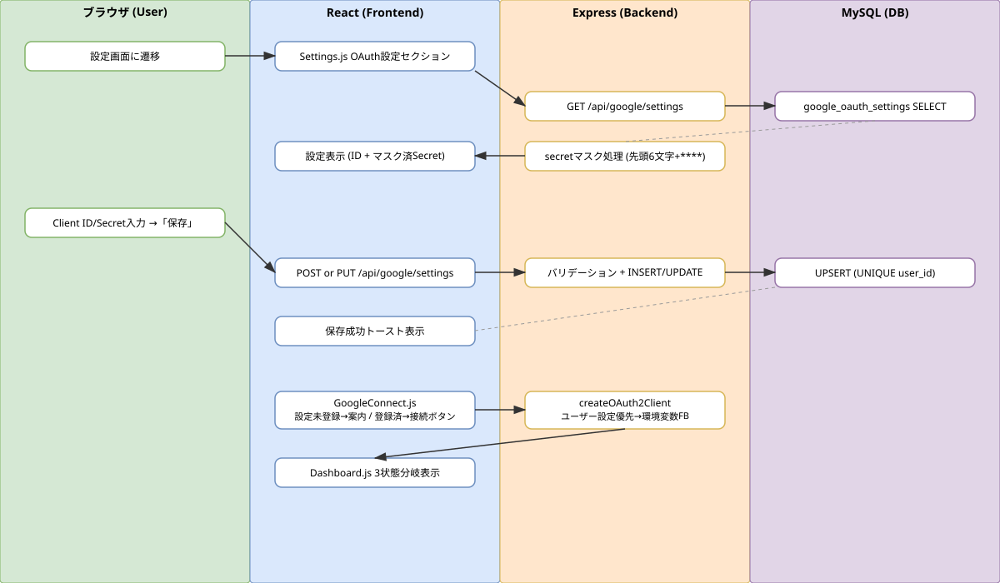

# Sprint 5: ユーザーごとの Google OAuth 設定

## 概要

ユーザーが独自の Google OAuth Client ID/Secret を登録・管理できる設定画面を提供し、createOAuth2Client でユーザー設定優先 + 環境変数フォールバックを実現する。

## ワークフロー図

## 処理フロー解説

### OAuth設定の登録フロー

1. **ブラウザ**: ユーザーがサイドバーから「設定」画面に遷移する
2. **React（Settings.js）**: OAuth設定セクションを表示。既存設定があれば GET /api/google/settings で取得し、Client ID とマスク済み Secret を表示する
3. **Express（googleSettings.js）**: GET / で google_oauth_settings テーブルからユーザーの設定を取得。client_secret はマスク処理（先頭6文字 + ****）して返す
4. **ブラウザ**: ユーザーが Client ID と Client Secret を入力し「保存」をクリック
5. **React**: POST /api/google/settings（新規）または PUT /api/google/settings（更新）を送信
6. **Express**: バリデーション後、google_oauth_settings テーブルに INSERT または UPDATE
7. **MySQL**: UNIQUE KEY (user_id) により1ユーザー1レコードを保証

### Google カレンダー接続フロー（設定後）

8. **React（GoogleConnect.js）**: 設定未登録時は「設定画面でOAuth情報を登録してください」と案内
9. **Express（google.js createOAuth2Client）**: ユーザーの google_oauth_settings を優先的に使用。未登録の場合は環境変数（GOOGLE_CLIENT_ID/SECRET）にフォールバック
10. **React（Dashboard.js）**: 3状態分岐 — OAuth設定なし / Google未接続 / 接続済み

## 関連ソースファイル

| ファイルパス | 役割 |
|---|---|
| backend/routes/googleSettings.js | OAuth設定 CRUD API（GET/POST/PUT/DELETE、secretマスク処理） |
| backend/routes/google.js | createOAuth2Client: ユーザー設定優先 + 環境変数フォールバック |
| frontend/src/components/Settings.js | OAuth設定画面（Client ID/Secret入力フォーム） |
| frontend/src/components/Dashboard.js | 3状態分岐（設定なし/未接続/接続済み） |
| frontend/src/components/GoogleConnect.js | 設定未登録時の案内表示 |
| docker/mysql/init/007_create_google_oauth_settings_table.sql | テーブル定義 |

## DBテーブル

### google_oauth_settings

| カラム | 型 | 説明 |
|---|---|---|
| id | INT AUTO_INCREMENT | 主キー |
| user_id | INT NOT NULL | ユーザーID（UNIQUE） |
| client_id | VARCHAR(255) | Google OAuth Client ID |
| client_secret | VARCHAR(255) | Google OAuth Client Secret |
| created_at | TIMESTAMP | 作成日時 |
| updated_at | TIMESTAMP | 更新日時 |

## APIエンドポイント

| Method | Path | 概要 |
|---|---|---|
| GET | /api/google/settings | ユーザーのOAuth設定取得（secretマスク済み） |
| POST | /api/google/settings | OAuth設定新規登録 |
| PUT | /api/google/settings | OAuth設定更新 |
| DELETE | /api/google/settings | OAuth設定削除 |
