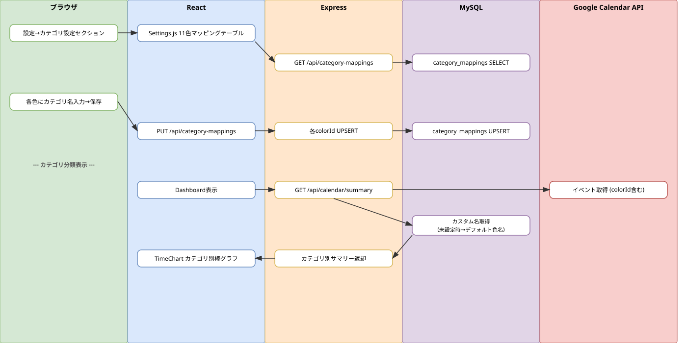

# Sprint 6: カテゴリ分類機能（イベント色ベース）

## 概要

Google カレンダーのイベント色（colorId 1-11）に基づいてカテゴリ分類を行い、ユーザーがカスタムカテゴリ名をマッピングできる設定UIと、棒グラフへのカテゴリ分類表示を実現する。

## ワークフロー図

## 処理フロー解説

### カテゴリ設定フロー

1. **ブラウザ**: ユーザーが「設定」画面のカテゴリ設定セクションを開く
2. **React（Settings.js）**: GOOGLE_EVENT_COLORS 定数を使い、11色のマッピングテーブルを表示。GET /api/category-mappings で既存のカスタム名を取得
3. **Express（categoryMappings.js）**: category_mappings テーブルからユーザーのマッピングを全件取得
4. **ブラウザ**: ユーザーが各色にカテゴリ名を入力（例: colorId=1 → 「仕事」）
5. **React**: PUT /api/category-mappings で一括更新
6. **Express**: 各 colorId について UPSERT（INSERT ON DUPLICATE KEY UPDATE）
7. **MySQL**: category_mappings テーブルに保存（UNIQUE KEY: user_id + google_color_id）

### カテゴリ分類表示フロー

8. **React（Dashboard.js）**: GET /api/calendar/summary で期間データ取得
9. **Express（calendar.js summary）**: Google Calendar API からイベント取得後、各イベントの colorId を確認
10. **Express**: category_mappings テーブルからカスタム名を取得。未設定の場合は GOOGLE_EVENT_COLORS のデフォルト色名を使用
11. **React（TimeChart.js）**: カテゴリ別に色分けされた積み上げ棒グラフを表示

## 関連ソースファイル

| ファイルパス | 役割 |
|---|---|
| backend/routes/categoryMappings.js | カテゴリマッピング CRUD API（GET/PUT/DELETE） |
| backend/routes/calendar.js | summary API: colorId ベースのカテゴリ分類拡張 |
| frontend/src/components/Settings.js | カテゴリ設定セクション（11色マッピングテーブル） |
| frontend/src/constants/googleEventColors.js | GOOGLE_EVENT_COLORS 定数（colorId 1-11 の日本語名 + HEX） |
| frontend/src/components/TimeChart.js | カテゴリ別積み上げ棒グラフ（Recharts） |
| docker/mysql/init/009_create_category_mappings_table.sql | テーブル定義 |

## DBテーブル

### category_mappings

| カラム | 型 | 説明 |
|---|---|---|
| id | INT AUTO_INCREMENT | 主キー |
| user_id | INT NOT NULL | ユーザーID |
| google_color_id | INT NOT NULL | Google イベント色ID（1-11） |
| category_name | VARCHAR(100) | カスタムカテゴリ名 |
| display_color | VARCHAR(7) | 表示用HEXカラー |
| created_at | TIMESTAMP | 作成日時 |
| updated_at | TIMESTAMP | 更新日時 |

UNIQUE KEY: (user_id, google_color_id)

## APIエンドポイント

| Method | Path | 概要 |
|---|---|---|
| GET | /api/category-mappings | ユーザーのカテゴリマッピング全件取得 |
| PUT | /api/category-mappings | カテゴリマッピング一括更新（UPSERT） |
| DELETE | /api/category-mappings/:colorId | 特定色のマッピング削除 |
| GET | /api/calendar/summary | カテゴリ分類済みのサマリーデータ取得 |
