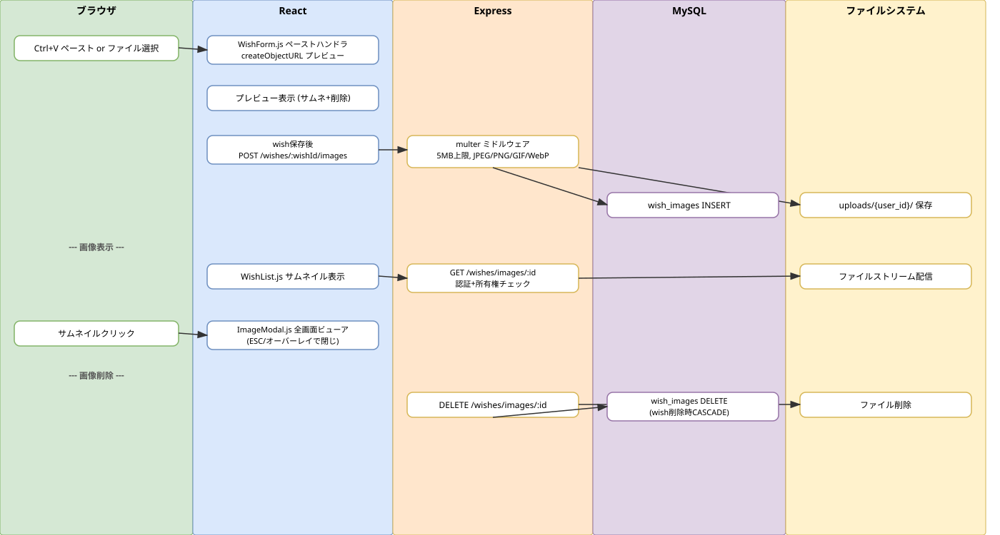

# Sprint 7: 画像貼り付け機能

## 概要

やりたいこと管理にCtrl+Vペースト・ファイル選択による画像アップロード機能を追加。multerによるファイル処理、サムネイル表示、全画面モーダルビューアを実現する。

## ワークフロー図

## 処理フロー解説

### 画像アップロードフロー

1. **ブラウザ**: ユーザーがWishForm内でCtrl+Vペースト、またはファイル選択ボタンをクリック
2. **React（WishForm.js）**: ペーストハンドラがClipboardEventからファイルを抽出。URL.createObjectURL()でプレビューURL生成。pendingFiles配列に追加
3. **React**: プレビュー表示（サムネイル + 削除ボタン）。wish保存後に画像アップロード実行
4. **React**: POST /api/wishes/:wishId/images（FormData + multipart/form-data）
5. **Express（wishImages.js）**: multerミドルウェアがファイルを受信（5MB上限、JPEG/PNG/GIF/WebP、5枚/wish上限）
6. **Express**: uploads/{user_id}/ ディレクトリに保存。wish_images テーブルにメタ情報INSERT
7. **MySQL**: wish_images レコード作成（wish_id, user_id, filename, original_name, mime_type, size）

### 画像表示フロー

8. **React（WishList.js）**: 各wishの画像をサムネイル表示
9. **React**: GET /api/wishes/images/:imageId で認証付き画像取得
10. **Express**: 所有権チェック（user_id一致確認）後、ファイルをストリーム配信
11. **ブラウザ**: サムネイルクリックで ImageModal（全画面ビューア）を表示。ESCキー/オーバーレイクリックで閉じる

### 画像削除フロー

12. **React**: DELETE /api/wishes/images/:imageId
13. **Express**: 所有権チェック後、ファイルシステムからファイル削除 + DBレコード削除
14. **Express**: wish削除時はCASCADE DELETEでDB自動クリーンアップ + ファイル自動削除

## 関連ソースファイル

| ファイルパス | 役割 |
|---|---|
| backend/routes/wishImages.js | 画像アップロード・配信・削除API（multer 5MB上限） |
| frontend/src/components/WishForm.js | ペーストハンドラ + プレビュー + アップロード統合 |
| frontend/src/components/WishList.js | サムネイル表示 + モーダル連携 |
| frontend/src/components/ImageModal.js | 全画面画像ビューア（ESC + オーバーレイ閉じ） |
| docker/mysql/init/010_create_wish_images_table.sql | テーブル定義 |

## DBテーブル

### wish_images

| カラム | 型 | 説明 |
|---|---|---|
| id | INT AUTO_INCREMENT | 主キー |
| wish_id | INT NOT NULL | 紐づくwish ID（CASCADE DELETE） |
| user_id | INT NOT NULL | ユーザーID（CASCADE DELETE） |
| filename | VARCHAR(255) | 保存ファイル名（UUID生成） |
| original_name | VARCHAR(255) | 元のファイル名 |
| mime_type | VARCHAR(100) | MIMEタイプ |
| size | INT | ファイルサイズ（バイト） |
| created_at | TIMESTAMP | 作成日時 |

## APIエンドポイント

| Method | Path | 概要 |
|---|---|---|
| POST | /api/wishes/:wishId/images | 画像アップロード（multer、5MB上限） |
| GET | /api/wishes/images/:imageId | 認証付き画像配信（所有権チェック） |
| DELETE | /api/wishes/images/:imageId | 画像削除（ファイル + DBレコード） |
