# Sprint 9: やりたいこと画面 UI改善ワークフロー

Sprint 9a〜9d で実装した4つのUI改善（テーブルビュー/ダークモード/サマリーバー・検索ソート/コンテキストメニュー・一括操作・キーボードショートカット）の統合ワークフロー。フロントエンドのみの変更で、バックエンドは既存API（PUT/DELETE）を利用。

## ワークフロー図

## 処理フロー解説

### 9a: テーブルビュー + サイドバー折りたたみ + 期限視覚強調

1. **ブラウザ**: ユーザーがビュー切替ボタン（☰テーブル / ▦カード）をクリック
2. **React (WishList.js)**: `viewMode` state を `card`/`table` に切替、localStorage に永続化
3. **React (WishList.js)**: テーブルビュー時は6カラム（タイトル・ステータス・優先度・期限・タグ・操作）でゼブラストライプ描画
4. **React (WishList.js)**: `getDueDateClass()` で期限日からの残り日数を計算し、5段階の色分けCSSクラスを付与（赤=期限切れ / オレンジ=3日以内 / 黄色=7日以内 / グレー=8日以上 / 薄グレー=期限なし）
5. **ブラウザ**: ユーザーがサイドバーの◀/▶トグルボタンをクリック
6. **React (MainLayout.js)**: `sidebarCollapsed` state を切替、localStorage に永続化
7. **React (Sidebar.js)**: `collapsed` props に応じて250px→40px にCSS transitionでアニメーション

### 9b: ダークモード実装

1. **ブラウザ**: 初回アクセス時、`localStorage` にテーマ設定があればそれを使用。なければ `matchMedia('prefers-color-scheme: dark')` でOS設定を自動検出
2. **React (MainLayout.js)**: `theme` state を管理。`document.documentElement.setAttribute('data-theme', theme)` でHTML要素にテーマ属性を設定
3. **React (App.css)**: `:root` に73+のCSS変数（ライトテーマ）、`[data-theme="dark"]` に57のCSS変数（ダークテーマ）を定義。全CSSファイル（10ファイル）がこれらの変数を参照
4. **ブラウザ**: ユーザーがHeader右上の🌙/☀️ボタンをクリック
5. **React (Header.js)**: `toggleTheme` コールバックを呼び出し、MainLayout.js の theme state を切替 + localStorage に永続化

### 9c: サマリーバー + 統合ツールバー（検索・ソート）

1. **ブラウザ**: ユーザーがサマリーバーのステータスバッジ（全て/未着手/進行中/完了）をクリック
2. **React (WishList.js)**: `selectedStatuses` (Set) に該当ステータスをトグル追加/削除。複数選択でOR条件フィルタ
3. **ブラウザ**: ユーザーが検索フィールドにテキスト入力
4. **React (WishFilter.js → WishList.js)**: `searchQuery` state を更新。300ms デバウンス後に `debouncedSearch` に反映。タイトル・説明・タグ名を対象に部分一致検索
5. **ブラウザ**: ユーザーがソートドロップダウンを変更
6. **React (WishFilter.js → WishList.js)**: `sortOrder` state を更新、localStorage に永続化。`sortWishes()` で6種ソート（作成日/優先度/期限の昇順・降順）を適用

### 9d: コンテキストメニュー + 一括操作 + キーボードショートカット

1. **ブラウザ**: ユーザーがテーブル行の⋯ボタンをクリック
2. **React (ActionMenu.js)**: ドロップダウンメニュー表示（編集/削除/ステータス変更サブメニュー）。外側クリック（mousedown イベント）で閉じる
3. **React (WishList.js)**: ステータス変更選択時、`handleStatusChange()` で既存 `PUT /api/wishes/:id` APIを呼び出し即時反映 + トースト通知
4. **ブラウザ**: ユーザーがチェックボックスで複数行を選択
5. **React (WishList.js)**: `selectedIds` (Set) で選択状態管理。フローティングアクションバー（画面下部固定）を表示
6. **React (WishList.js)**: 一括操作ボタン押下時、`handleBulkStatusChange()` / `handleBulkDelete()` で `Promise.all` による一括処理
7. **ブラウザ**: ユーザーがキーボードショートカットを押下（例: N, E, Delete, ↑↓, Space, /, ?, Escape）
8. **React (useKeyboardShortcuts.js)**: 3層ガードで判定 — テキスト入力中(input/textarea/select)は無効化 → `isDisabled` チェック → テーブル専用キー(↑↓/Space)はテーブルビュー時のみ有効
9. **React (WishList.js)**: 対応するアクションを実行（新規作成/編集/削除/フォーカス移動/選択トグル/検索/ヘルプ表示/解除）

## 関連ソースファイル

| ファイルパス | 役割 |
|------------|------|
| `frontend/src/components/WishList.js` | テーブルビュー、サマリーバー、一括操作、キーボード統合、ステータス変更処理 |
| `frontend/src/components/WishList.css` | テーブルCSS、期限色CSS、サマリーバースタイル、ビュー切替CSS |
| `frontend/src/components/WishFilter.js` | 検索フィールド（🔍+×）、ソートドロップダウン、SORT_OPTIONS定数 |
| `frontend/src/components/WishFilter.css` | ツールバー1行flex化、検索/ソートスタイル |
| `frontend/src/components/MainLayout.js` | sidebarCollapsed state、theme state、data-theme属性管理 |
| `frontend/src/components/MainLayout.css` | レイアウトCSS変数定義 |
| `frontend/src/App.css` | グローバルCSS変数（:root 73+ / [data-theme="dark"] 57変数） |
| `frontend/src/components/Header.js` | 🌙/☀️テーマ切替ボタン |
| `frontend/src/components/Header.css` | テーマ切替ボタンスタイル |
| `frontend/src/components/Sidebar.js` | collapsed/onToggle props、◀/▶トグルボタン、short表示 |
| `frontend/src/components/Sidebar.css` | collapsed transition、トグルボタン位置切替 |
| `frontend/src/components/ActionMenu.js` | ⋯ドロップダウンメニュー、ステータス変更サブメニュー、外側クリック閉じ |
| `frontend/src/components/ActionMenu.css` | ドロップダウン+サブメニュースタイル（z-index: 100） |
| `frontend/src/components/useKeyboardShortcuts.js` | カスタムフック、9キー対応、3層ガード |
| `frontend/src/components/ShortcutHelp.js` | ?キーヘルプモーダル（キー一覧テーブル） |
| `frontend/src/components/ShortcutHelp.css` | ヘルプモーダルスタイル（z-index: 1500） |

## APIエンドポイント（既存利用）

| Method | Path | 概要 |
|--------|------|------|
| PUT | `/api/wishes/:id` | ステータス変更（ActionMenu / 一括操作） |
| DELETE | `/api/wishes/:id` | 削除（ActionMenu / 一括操作） |

※ Sprint 9 はフロントエンドのみの変更。バックエンドAPIの新規追加なし。

## z-index 階層

| 要素 | z-index | 用途 |
|------|---------|------|
| bulk-action-bar | 50 | フローティング一括操作バー |
| ActionMenu | 100 | コンテキストメニュー |
| ImageModal | 1000 | 全画面画像ビューア |
| ShortcutHelp / SkillModal | 1500 | ヘルプ/詳細モーダル |
| Toast | 2000 | トースト通知 |
